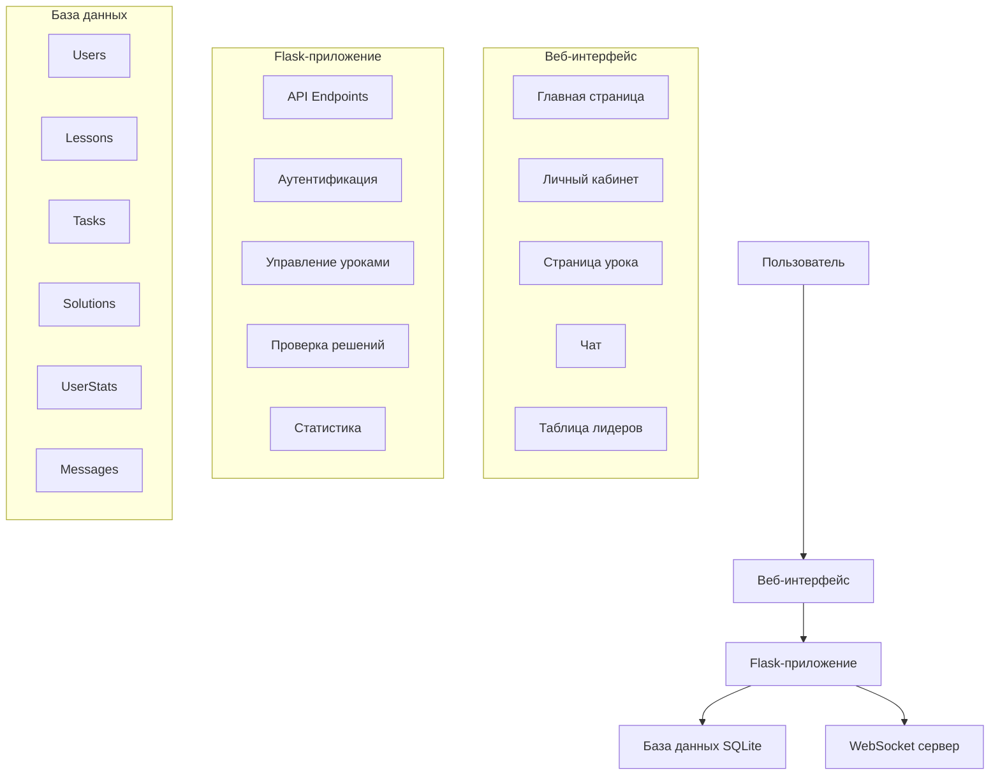

# Схема работы образовательной платформы

## Описание компонентов

### 1. Веб-интерфейс
- **Главная страница**: Описание платформы, регистрация, вход
- **Личный кабинет**: 
  - Список уроков (открытые/закрытые)
  - Прогресс обучения
  - Статистика
- **Страница урока**:
  - Теоретический материал
  - Практические задания
  - Встроенный редактор кода
- **Чат**: Общение между пользователями
- **Таблица лидеров**: Рейтинг пользователей

### 2. Flask-приложение
- **API Endpoints**: REST API для взаимодействия с фронтендом
- **Аутентификация**: Регистрация, вход, управление сессиями
- **Управление уроками**: Создание, редактирование, проверка доступа
- **Проверка решений**: Автоматическая проверка кода
- **Статистика**: Подсчет баллов, рейтинга, достижений

### 3. База данных
- **Users**: Информация о пользователях
- **Lessons**: Уроки и их содержимое
- **Tasks**: Практические задания
- **Solutions**: Решения пользователей
- **UserStats**: Статистика и прогресс
- **Messages**: Сообщения в чате

## Взаимодействие компонентов

1. **Аутентификация**:
   - Пользователь регистрируется/входит через веб-интерфейс
   - Данные отправляются в Flask-приложение
   - Проверка и сохранение в базе данных
   - Создание сессии

2. **Работа с уроками**:
   - Пользователь запрашивает список уроков
   - Flask-приложение проверяет доступные уроки
   - Отображение открытых/закрытых уроков
   - При открытии урока загружается контент

3. **Выполнение заданий**:
   - Пользователь пишет код в редакторе
   - Код отправляется на проверку
   - Flask-приложение проверяет решение
   - Результат сохраняется в базе данных
   - Обновляется статистика и рейтинг

4. **Чат**:
   - Пользователь отправляет сообщение
   - WebSocket сервер передает сообщение
   - Сообщение сохраняется в базе данных
   - Другие пользователи получают уведомление

5. **Рейтинг**:
   - Система подсчитывает баллы за решения
   - Обновляется статистика пользователей
   - Формируется таблица лидеров
   - Проверяются и выдают достижения 